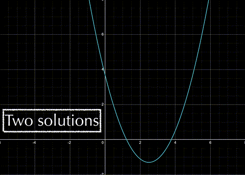

# **Solving Polynomial Equations**

---

## **Table of Contents**
1. [Introduction](#1---introduction)
2. [Linear Solver](#2---linear-solver)
3. [Quadratic Solver](#3---quadratic-solver)
---

## **1 - Introduction**

This project is about building a **polynomial equation solver** that can handle linear equations and quadratic equations.

We will be using Rust all along, and use Rust's powerful testing tools all along to follow a Test Driven Development approach.

---

## **2 - Linear Solver**

In TDD we first define the expected behaviour of a function using tests before we even write the function itself.
This way, we have a clear set of criteria for what our code needs to achieve.

Let's start by handling the simpler cases, like [linear equations](https://en.wikipedia.org/wiki/Linear_equation).

Linear equations are of the form `ax + b = 0` represented as follows on a graph:

<div align="center">
  <h3><i>Linear Equation Graph: y = ax + b</i></h3>
  
</div>

As shown in the graph above, there is only one case when a linear equation has zero solution: when `a` is equal to zero.
Otherwise, we can determine the value of `x` for which `y` will be `null` using the following formula:

<div align="center">
  
</div>

We will start now our [Test Driven Development](https://en.wikipedia.org/wiki/Test-driven_development) journey by writing tests for this function.
We are placing this tests in a module below the function definition.

Here’s a quick look at the main tools we’ll use to write tests:

- **#[cfg(test)]:** marks a test module, so it only gets compiled when running tests, but is ignored by the compiler when building the project.
- **#[test]:** marks a function as a test case.
- **assert_eq!:** macro used to compare what we expect our function to return with what it actually returns, and fails the test if they don’t match.

Since a linear equation of the form  `ax + b = 0` may or may not have a valid solution, it's a great place to use Rust's [`Option`](https://doc.rust-lang.org/book/ch06-01-defining-an-enum.html#the-option-enum-and-its-advantages-over-null-values) type.
The `solve_linear` function will wrap the value `x` in `Some(x)` when a valid solution exists, or return `None` if there is no solution (for example when `a` is zero).

With that being said, we can write our first unit tests for the future `solve_linear` function.

Notice that we are writing these tests first before the actual function definition.

```rust
pub fn solve_linear(a: f64, b: f64) -> Option<f64> {
  unimplemented!()
}

#[cfg(test)]
mod tests {
    use super::*;

    #[test]
    fn test_simple_solution() {
        assert_eq!(solve_linear(2.0, 4.0), Some(-2.0));
    }

    #[test]
    fn test_negative_coefficient_a() {
        assert_eq!(solve_linear(-3.0, 9.0), Some(3.0));
    }

    #[test]
    fn test_negative_coefficient_b() {
        assert_eq!(solve_linear(4.0, -8.0), Some(2.0));
    }

    #[test]
    fn test_no_solution() {
        assert_eq!(solve_linear(0.0, 4.0), None);
    }

    #[test]
    fn test_zero_both_coefficient() {
        assert_eq!(solve_linear(0.0, 0.0), None);
    }

    #[test]
    fn test_edge_case_small_value() {
        assert_eq!(solve_linear(1e-10, 1e-10), Some(-1.0));
    }
}
```

Now that our tests are defined, we can finally implement the `solve_linear` function:

```rust
pub fn solve_linear(a: f64, b: f64) -> Option<f64> {
    if a == 0.0 {
        return None; // No solution
    }
    Some(-b / a)
}
```

Once we have implemented the function, we can run the tests using `cargo test` in the terminal.
If everything is working as expected, all the tests will pass!

---

## **3 - Quadratic Solver**

Now that we're done with linear equation, let's move on [Quadratic](https://en.wikipedia.org/wiki/Quadratic_equation).
Quadratic equations are of the form `ax^2 + bx + c = 0`, and their graphic representation is called a `parabola`.

<div align="center">
  <h3><i>Quadratic Equation Parabola: y = ax^2 + bx + c</i></h3>
  
</div>

We can solve this type of equation in two steps. First we calculate its `discriminant` ∆ (“delta”):

<div align="center">
  
</div>

Then, if the discriminant `∆ ≥ 0`, the equation has one or two real solutions.
The solutions are calculated as:

<div align="center">
  
  
  
</div>

Note that in the case of a single solution, the discriminant ∆ will be null and the unique solution can be expressed as:

<div align="center">
  
</div>

We will be using an enum to represent the 3 different outcomes for the quadratic equation.
The enum QuadraticSolution holds the 3 types of solutions possible, and we will use it as a return type for our solve_quadratic function.

```rust
pub enum QuadraticSolution {
    NoRealSolution,
    OneRealSolution(f64),
    TwoRealSolutions(f64, f64),
}
```

We can now continue by writing the unit tests for the `solve_quadratic` function.

```rust
#[cfg(test)]
mod tests {
    use super::*;

    #[test]
    fn test_no_solution() {
        let solution: QuadraticSolution = solve_quadratic(1.0, 0.0, 1.0);
        assert!(matches!(solution, QuadraticSolution::NoRealSolution));
    }

    #[test]
    fn test_one_solution() {
        let solution: QuadraticSolution = solve_quadratic(1.0, -2.0, 1.0);
        if let QuadraticSolution::OneRealSolution(x) = solution {
            assert_eq!(x, 1.0);
        } else {
            panic!("Expected one real solution.");
        }
    }

    #[test]
    fn test_two_solutions() {
        let solution: QuadraticSolution = solve_quadratic(1.0, -3.0, 2.0);
        if let  QuadraticSolution::TwoRealSolutions(x1, x2) = solution {
            assert_eq!(x1, 1.0);
            assert_eq!(x2, 2.0);
        } else {
            panic!("Expected two real solutions");
        }
    }

    #[test]
    #[should_panic(expected = "Coefficient 'a' cannot be 0 in a quadratic equation. Use a linear solver.")]
    fn test_panic_on_zero_a() {
        solve_quadratic(0.0, 2.0, 1.0);
    }
}
```
Now that we have the tests, we continue by implementing `solve_quadratic`.

```rust
pub fn solve_quadratic(a: f64, b: f64, c: f64) -> QuadraticSolution {
    if a == 0.0 {
        panic!("Coefficient 'a' cannot be 0 in a quadratic equation. Use a linear solver.")
    }

    let delta: f64 = b * b - (4.0 * a * c);
    if delta < 0.0 {
        return QuadraticSolution::NoRealSolution;
    }

    let sqrt_delta: f64 = basic::square_root(delta).unwrap();

    let x1: f64 = (-b - sqrt_delta) / (2.0 * a);
    let x2: f64 = (-b + sqrt_delta) / (2.0 * a);

    if delta == 0.0 {
        return QuadraticSolution::OneRealSolution(x1);
    }
    return QuadraticSolution::TwoRealSolutions(x1, x2);
}
```
