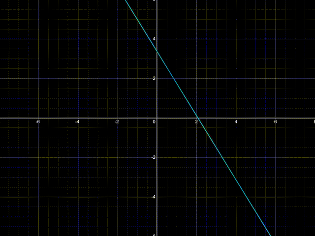

# **ComputorV1: A Polynomial Equation Solver**

---

## **Table of Contents**
1. [Introduction](#1---introduction)
2. [Solving Linear Equations](#2---solving-linear-equations)
3. [Quadratic Solver](#3---quadratic-solver)
4. [Existing Algorithms for Higher Degree Polynomials](#5---existing-algorithms-for-higher-degree-polynomials)
5. [Crafting a Robust Program Design](#6---crafting-a-robust-program-design)
6. [Conquer the Chaos: Mastering Error Handling](#7---conquer-the-chaos-mastering-error-handling)
7. [Next Steps: Where to Go From Here](#8---next-steps-where-to-go-from-here)

---

## **1 - Introduction**

In this project, we will build a **polynomial equation solver** that can handle equations of varying degrees (from linear to quartic). Polynomials are fundamental structures in both mathematics and programming, and solving them efficiently can serve as a building block for more advanced algorithms.

- **Language:** We chose **[Rust](https://doc.rust-lang.org/book/title-page.html)** for its memory safety, performance, and expressive type system, which is perfect for building reliable and efficient solvers.
- **Approach:** We'll adopt a **[Test-Driven Development (TDD)](https://en.wikipedia.org/wiki/Test-driven_development)** approach, where we write tests before implementing the solver functions.
---

## **2 - Solving linear equations**

In TDD we first define the expected behaviour of a function using tests before we even write the function itself.
This way, we have a clear set of criteria for what our code needs to achieve.

Let's start by handling the simpler cases, like linear equations.

Linear equations are of the form `ax + b = 0` represented as follows on a graph: 


<div align="center">
  <h3><i>Linear Equation Graph: y = ax + b</i></h3>
  
</div>

As shown in the graph above, there is only one case when a linear equation has zero solution: when `a` is equal to zero.
Otherwise, we can determine the value of `x` for which `y` will be `null` using the following formula:

<div align="center">
  
</div>

Now we will start with TDD by writing tests for this function.
We are placing this tests in a module below the function definition.
Rust makes testing easy with its built-in test framework, so you can quickly check that your code works just the way you expect!

Here’s a quick look at the main tools we’ll use to write tests:

- **#[cfg(test)]:** Used to marks a module, so it only gets compiled when running tests, but is ignored by the compiler when building the project.
- **#[test]:** Used to mark a function as a test case.
- **assert_eq!:** A macro used to compare what we expect our function to return with what it actually returns. If they don’t match, the test fails.

Below is the test module with tests for the future `solve_linear` function.

Since a linear equation of the form  `ax + b = 0` may or may not have a valid solution, it's a great place to use Rust's [`Option`](https://doc.rust-lang.org/book/ch06-01-defining-an-enum.html#the-option-enum-and-its-advantages-over-null-values) type.
The `solve_linear` function will wrap the value `x` in `Some(x)` when a valid solution exists, or return `None` if there is no solution (for example when `a` is zero).

Notice that we are writing these tests first before the actual function definition.

```rust
#[cfg(test)]
mod tests {
    use super::*;

    #[test]
    fn test_simple_solution() {
        assert_eq!(solve_linear(2.0, 4.0), Some(-2.0));
    }

    #[test]
    fn test_negative_coefficient_a() {
        assert_eq!(solve_linear(-3.0, 9.0), Some(3.0));
    }

    #[test]
    fn test_negative_coefficient_b() {
        assert_eq!(solve_linear(4.0, -8.0), Some(2.0));
    }

    #[test]
    fn test_no_solution() {
        assert_eq!(solve_linear(0.0, 4.0), None);
    }

    #[test]
    fn test_zero_both_coefficient() {
        assert_eq!(solve_linear(0.0, 0.0), None);
    }

    #[test]
    fn test_edge_case_small_value() {
        assert_eq!(solve_linear(1e-10, 1e-10), Some(-1.0));
    }
}
```

Now that our tests are defined, we can finally implement the `solve_linear` function:

```rust
pub fn solve_linear(a: f64, b: f64) -> Option<f64> {
    if a == 0.0 {
        return None; // No solution
    }
    Some(-b / a)
}
```

This function takes `a` and `b` as inputs and returns either `Some(x)` if it finds a solution, or `None` if there isn’t one (when `a` is zero).
Clean and simple, right?

Once you have implemented the function, try running the tests using `cargo test` in the terminal.
If everything is working as expected, all the tests will pass! If you see any failures, no problem - it's just a chance
to make your code even better! Tweak things until tests goes green, and enjoy the process You've got this!
---

## **3 - Quadratic Solver**

- **Quadratic Solver:** Using the **quadratic formula** to solve equations of the form `ax^2 + bx + c = 0`.

---

## **5 - Existing Algorithms for Higher Degree Polynomials**

Once the basics are covered, we’ll move to more advanced algorithms for solving **cubic and quartic** equations:
- **Analytical Approach**:
    - **Derivatives**: By finding the derivative of a polynomial, we can identify critical points, inflection points, and make predictions about the behavior of the function. While this doesn’t solve the polynomial directly, it provides insights for more efficient numerical methods.
    - **Root Refinement**: Derivatives can be used alongside root-finding algorithms to refine the accuracy of potential solutions. We’ll show how to calculate derivatives programmatically in Rust to support root-finding algorithms.

- **Numerical Methods**:
    - **Newton’s Method**: Iterative method to approximate roots.
    - **Durand-Kerner Method**: A complex, but effective algorithm for solving polynomials of higher degrees.
    - **Newton-Raphson Algorithm**: Commonly used for finding successively better approximations to the roots.

This section dives into how these algorithms work and provides Rust implementations.

---

## **6 - Crafting a Robust Program Design**

This section focuses on creating a robust, scalable design for the solver:
- **Data Structures:** How to represent polynomials and their coefficients effectively in Rust.
- **Modular Design:** Break down the solver into reusable, maintainable components.
- **Performance Considerations:** Optimizing memory usage and execution speed to handle large polynomials efficiently.

---

## **7 - Conquer the Chaos: Mastering Error Handling**

A good solver must handle all potential errors gracefully. In this section, we’ll tackle:
- **Parsing Errors:** How to manage invalid input or malformed equations.
- **No Solution or Complex Solutions:** Handling cases where no real solution exists (e.g., complex roots) by leveraging Rust’s `Result` and `Option` types.

This section will walk you through best practices for error handling, making your program more reliable and user-friendly.

---

## **8 - Next Steps: Where to Go From Here**

Once you’ve mastered solving polynomial equations, you can take this project even further:
- **Polynomial Operations:** Implement support for operations like addition, subtraction, multiplication, and division of polynomials.
- **Graphing Polynomial Functions:** Visualize solutions graphically using Rust libraries.
- **Extending to Systems of Equations:** Tackle more complex mathematical problems by extending your solver to handle systems of polynomial equations.

Explore additional resources and continue growing your knowledge!

---

### **Project Status**
- [x] Naming and structuring the documentation
- [ ] Rewrite the first text because I will not push my source code to the public repository but only my unit tests
- [ ] Implementing a linear polynomials solver
- [ ] Implementing quadratic polynomials (via the quadratic formula)
- [ ] Solving cubic and quartic polynomials (advanced algorithms)
- [ ] Lint the code with clippy
- [ ] use Rustfmt to properly format your rust code